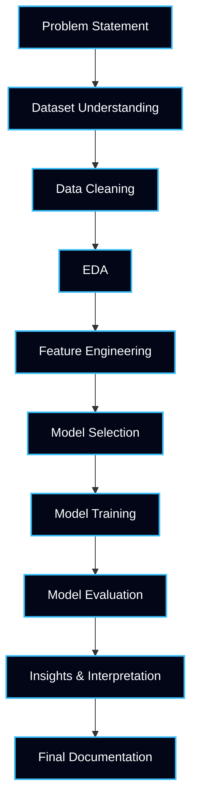
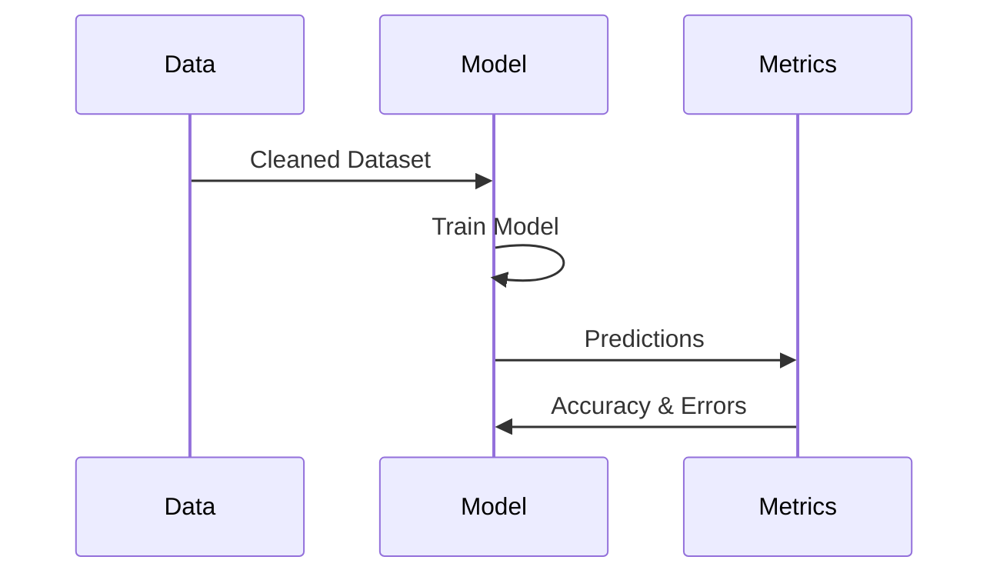

<!-- ========================================================= -->
<!-- ========== CODEC TECHNOLOGY – AI INTERNSHIP ============== -->
<!-- ========================================================= -->

<p align="center">
  
</p>

<h1 align="center">🤖 Codec Technology – AI Internship Projects</h1>

<p align="center">
<b>Industry-Oriented Artificial Intelligence Internship Repository</b><br>
Showcasing <b>applied AI, machine learning workflows, and data-driven problem solving</b>
</p>

---

##  Repository Overview

```txt
Internship Type   : Artificial Intelligence (AI)
Organization      : Codec Technology
Focus Area        : Applied Machine Learning & Analytics
Approach          : Hands-on | Project-Based | Industry-Oriented
Outcome           : Job-Ready AI Portfolio
````

This repository documents my **complete AI internship journey**, including:

* Real-world datasets
* End-to-end ML workflows
* Data preprocessing → modeling → evaluation
* Professional documentation & presentation

---

## 🔥 Repository Metrics

<p align="center">


</p>

<p align="center">


</p>

---

## 🎯 Internship Objectives (Industry-Aligned)

* Apply **AI concepts to real business problems**
* Perform **data cleaning & preprocessing**
* Build **predictive ML models**
* Evaluate models using **statistical metrics**
* Interpret outputs for **decision-making**
* Develop **professional documentation skills**

---

## 🧠 AI Skills Mapped to Industry Expectations

| Industry Requirement | Internship Skill                    |
| -------------------- | ----------------------------------- |
| Data Understanding   | Exploratory Data Analysis           |
| Clean Pipelines      | Data Cleaning & Feature Engineering |
| Predictive Logic     | ML Model Training                   |
| Accuracy Control     | Evaluation Metrics                  |
| Business Thinking    | Insight Interpretation              |
| Team Readiness       | Structured Code & Docs              |

---

## 📦 Project Lifecycle (Technical View)



---

## 🧭 Internship Learning Roadmap


---

## 🧪 Typical AI Project Structure

```txt
📁 Project_Name/
│
├── 📄 problem_statement.md
├── 📊 dataset.csv
├── 📓 analysis.ipynb
├── 🧠 model_training.ipynb
├── 📈 evaluation_results.md
├── 📋 insights.md
└── 📑 README.md
```

---

## 📊 Data Handling & Preprocessing

**Techniques Used**

* Missing Value Handling
* Outlier Detection
* Encoding Categorical Variables
* Feature Scaling
* Data Type Optimization

```python
df.isnull().sum()
df.fillna(df.mean(), inplace=True)
```

---

## 🧠 Machine Learning Workflow



---

## 📈 Evaluation Metrics Used

| Metric    | Purpose                |
| --------- | ---------------------- |
| Accuracy  | Overall correctness    |
| Precision | False positive control |
| Recall    | False negative control |
| F1 Score  | Balance metric         |
| RMSE      | Regression error       |

---

## 🛠️ Tools & Technology Stack

| Tool         | Usage                |
| ------------ | -------------------- |
| Python       | Core Programming     |
| Pandas       | Data Processing      |
| NumPy        | Numerical Operations |
| Matplotlib   | Visualization        |
| Seaborn      | Pattern Detection    |
| Scikit-learn | ML Models            |
| GitHub       | Version Control      |

---

## 🧑‍💻 Author

**Ashwin Ananta Panbude**
AI Intern | Data Analyst | Faculty

<p align="center">
  <a href="https://github.com/Ashwin18-Offcl">
    
  </a>
  <a href="https://bit.ly/49pSuZJ">
    
  </a>
</p>

---

##  Summary 

AI Internship repository demonstrating real-world application of machine learning concepts including data preprocessing, exploratory data analysis, feature engineering, predictive modeling, model evaluation, and professional documentation. Designed to reflect industry-ready analytical thinking and problem-solving skills.

